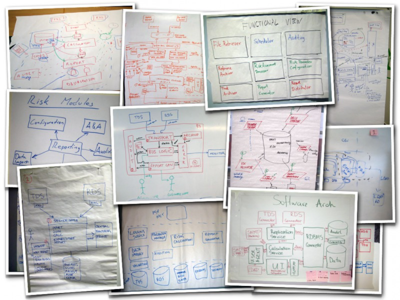
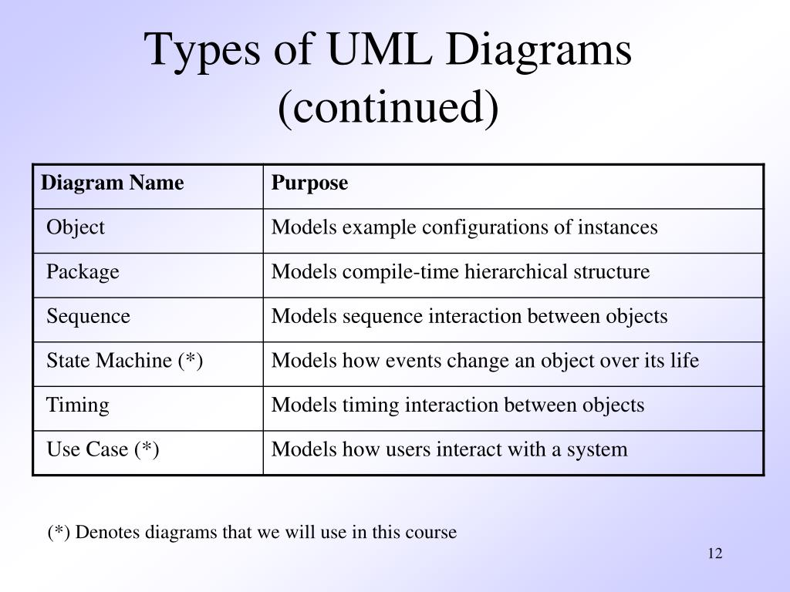
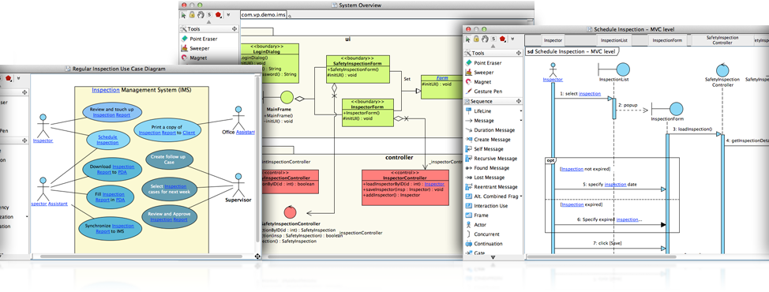
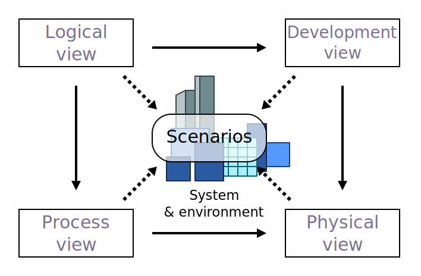
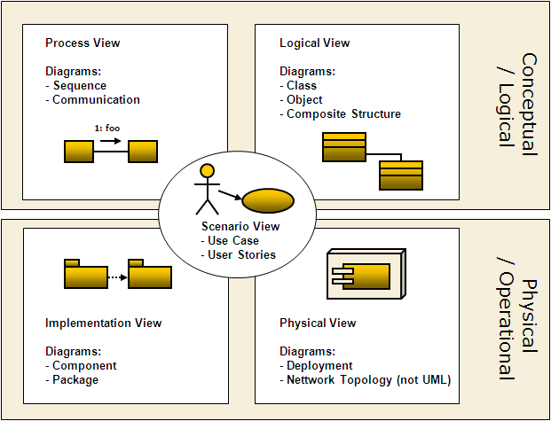
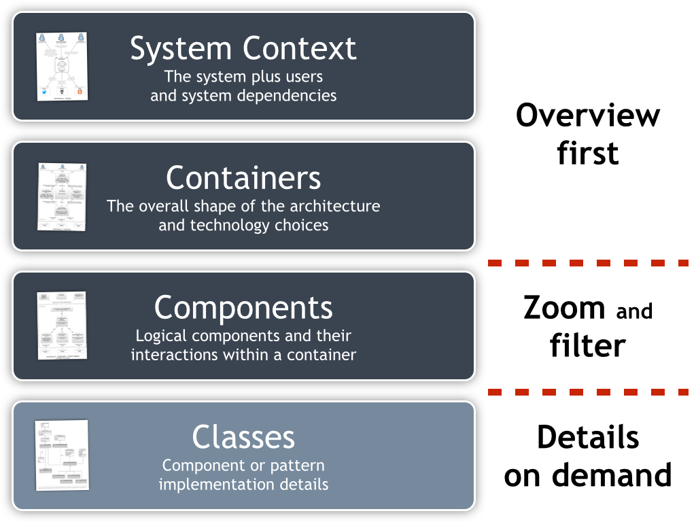

# Notes

## Standard Notation

There is no (unique) standard notation for design Software Architecture.

### UML

**UML**, short for Unified Modeling Language, is a standardized modeling language consisting of an integrated set of diagrams, developed to help system and software developers for specifying, visualizing, constructing, and documenting the artifacts of software systems, as well as for business modeling and other non-software systems. The UML represents a collection of best engineering practices that have proven successful in the modeling of large and complex systems. 

The **UML** is a very important part of developing object oriented software and the software development process. The UML uses mostly graphical notations to express the design of software projects. Using the UML helps project teams communicate, explore potential designs, and validate the architectural design of the software. In this article, we will give you detailed ideas about what is UML, the history of UML and a description of each UML diagram type, along with UML examples.

### 4+1 architectural view model (Kruchten)

4+1 is a view model used for *"describing the architecture of software-intensive systems, based on the use of multiple, concurrent views"*. The views are used to describe the system from the viewpoint of different stakeholders, such as end-users, developers, system engineers, and project managers. The four views of the model are logical, development, process and physical view. In addition, selected use cases or scenarios are used to illustrate the architecture serving as the 'plus one' view. Hence, the model contains 4+1 views:

* **Logical view**: The logical view is concerned with the functionality that the system provides to end-users. UML diagrams are used to represent the logical view, and include class diagrams, and state diagrams.
* **Process view:** The process view deals with the dynamic aspects of the system, explains the system processes and how they communicate, and focuses on the run time behavior of the system. The process view addresses concurrency, distribution, integrator, performance, and scalability, etc. UML diagrams to represent process view include the sequence diagram, communication diagram, activity diagram.
* **Development view**: The development view illustrates a system from a programmer's perspective and is concerned with software management. This view is also known as the implementation view. UML Diagrams used to represent the development view include the Package diagram and the Component diagram.
* **Physical view**: The physical view (aka the deployment view) depicts the system from a system engineer's point of view. It is concerned with the topology of software components on the physical layer as well as the physical connections between these components. UML diagrams used to represent the physical view include the deployment diagram.
* **Scenarios**: The description of an architecture is illustrated using a small set of use cases, or scenarios, which become a fifth view. The scenarios describe sequences of interactions between objects and between processes. They are used to identify architectural elements and to illustrate and validate the architecture design. They also serve as a starting point for tests of an architecture prototype. This view is also known as the use case view.

The 4+1 view model is generic and is not restricted to any notation, tool or design method. Quoting Kruchten.

## C4 Model

C4 is quite a flexible framework that could be used differently depending on our needs. It has a lot of advantages but also some drawbacks.
Advantages of C4

* Not hard to maintain (easier than most solutions).
* Presents views from different perspectives.
* Could be helpful on an organizational level (not only for technical staff).
* Removes ambiguous notations.
* Some parts could be generated automatically.

Drawbacks of C4

* Static visualization. We do not know when and how often each relation happens.
* Low-level abstractions are very fragile and need to be updated regularly.
